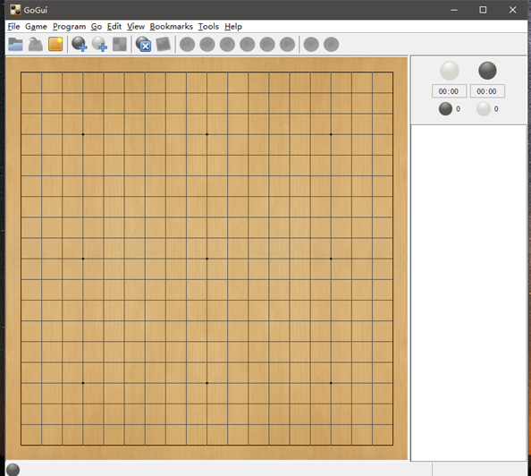
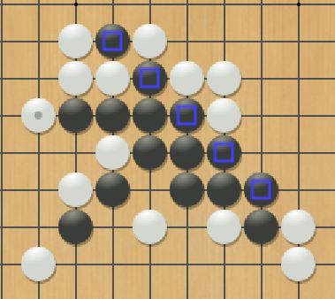

# Gomoku AI Players

## Project Overview

This project develops a Gomoku AI system supporting multiple decision-making strategies, from basic random strategies to advanced FlatMCS and Monte Carlo Tree Search (MCTS) techniques. The goal is to enhance the decision efficiency and win rate of AI players in matches by simulating optimal moves through various strategies.

## Directory Structure

- `FlatMCS_Player/`  
  Contains code for players based on the Flat Monte Carlo Simulation (FlatMCS) strategy.

  - `board.py`, `board_base.py`, `board_util.py` - Manages board state, core data structures, and utilities.
  - `engine.py` - Engine controlling the behavior of FlatMCS players.
  - `gtp_connection.py` - Interface for Go Text Protocol (GTP).
  - `nogo_ucb.py` - Implements a Gomoku player based on the UCB strategy.

- `Mcts_Player/`  
  Contains player code based on the Monte Carlo Tree Search (MCTS) strategy, utilizing a recursive search tree for adaptive search.

  - `PatternSelection.py` - Selects moves based on probabilistic strategies informed by board patterns.
  - `mcts.py` - Core MCTS algorithm, including tree node expansion and UCB strategy.
  - `nogo4.py` - An advanced Gomoku AI player combining UCB and MCTS strategies.
  - `simulation_engine.py` - Manages Monte Carlo simulations for various strategies.
  - Other files, such as `board.py`, are similar to those in `FlatMCS_Player`.

- `Random_Player/`  
  Contains code for a player using random strategies, selecting moves randomly among valid moves.

  - `nogo_random.py` - Implements a basic random strategy for the Gomoku player.
  - Other files, such as `board.py` and `engine.py`, are similar to those in `FlatMCS_Player`.

- `README.md` - Project documentation.
- `game_results.txt` - Records match results between players.
- `play.py` - Script to start matches and tests between different AI players.

## Features

### Random Player

- **Basic Rules Implementation**: Implements Gomoku rules, including generating legal moves, checking win conditions (five consecutive stones), and detecting game end.
- **Board State Management**: Updates board state and determines the final result of the current game, returning "unknown" if unresolved.
- **Time Management**: Ensures the program completes within the specified time, accurately identifying the winner in basic and test cases.

### FlatMCS Player

- **Flat Monte Carlo Simulation**: Implements the FlatMCS strategy, running 10 simulations for each legal move and selecting the move with the highest win rate.
- **Priority Rules**: Simulation results are prioritized as follows:
  - Win: Execute if there is an immediate winning move.
  - BlockWin: Block an immediate win for the opponent.
  - OpenFour: Create an "open four" to increase winning chances.
  - BlockOpenFour: Prevent the opponent from forming an "open four."
  - Random: Choose randomly if none of the above apply.

### MCTS Player

- **Monte Carlo Tree Search (MCTS)**: Constructs a tree-based Gomoku player, combining UCB (Upper Confidence Bound) to optimize exploration and exploitation.
- **Dynamic Node Expansion**: Expands nodes based on the UCB algorithm, enhancing adaptability to complex game states, reducing redundant node visits, and improving search efficiency.
- **Adaptive Search**: Optimizes win rate in complex games, especially effective in high-difficulty matches and tournaments.

> Note: All players run on a 7x7 board with a 60-second time limit and a 1GB memory limit.

## Technical Implementation

- **MCTS + UCB**: Combines UCB with decision-making in the search tree, reducing unnecessary node expansions and enhancing search efficiency.
- **Multi-strategy Monte Carlo Simulation**: Implements both Flat Monte Carlo and feature-based probabilistic simulation strategies, allowing AI players to adapt strategies based on board state.
- **GTP Compatibility**: Allows AI players to compete with other programs using a standardized GTP interface.

## Usage

### Dependencies

Ensure Python 3.7 or above is installed, along with GoGui for graphical testing.

### GoGui Instructions

GoGui is a graphical user interface (GUI) and toolset for board games. This project uses GoGui to display Gomoku AI match results and testing.

<p align="center">
  
</p>

1. **Install GoGui**  
   Download and install GoGui, ensuring `gogui-regress` and `gogui-twogtp` commands are in the PATH.
2. **Run gogui-regress Tests**  
   Run the following command to test:

   ```bash
   gogui-regress ./Go1.py assignment1-public-tests.gtp

   ```

3. **Testing Matches with gogui-twogtp**  
   Use the script below to test matches between different players:
   ```#!/bin/bash
   set -eu
   RESULTDIR="your_result_directory_here"
   GO1="path_to_player1"
   GO2="path_to_player2"
   NUGAMES=10
   BOARDSIZE=7
   gogui-twogtp -black "$GO1" -white "$GO2" -auto -komi 0 -size $BOARDSIZE -games $NUGAMES -sgffile $RESULTDIR/game
   ```

<p align="center">
  
</p>

This image shows a sample Gomoku game state during project execution.
Here, black stones represent the AI's moves, white stones are the standard bot's moves, and highlighted squares mark key positions where the AI aims to complete its sequences.

> Note: While this example is not displayed on the standard 7x7 board used in this project, it still illustrates the AI’s decision-making process.

## Performance Statistics

| Player         | Win Rate | Average Moves | Average Time per Move |
| -------------- | -------- | ------------- | --------------------- |
| Random Player  | N/A      | N/A           | N/A                   |
| FlatMCS Player | 65%      | 32.3          | 1.85s                 |
| MCTS Player    | 80%      | 31.65         | 1.89s                 |

> **Note**: Since the win rate of the random player is approximately zero, it is excluded from further discussion and testing.

## Results

### Flat MCS Player vs Standard Bot

| Game | Player 1 (Flat MCS) | Player 2 (Standard Bot) | Winner   | Moves Taken |
| ---- | ------------------- | ----------------------- | -------- | ----------- |
| 1    | Win                 | Loss                    | Player 1 | 37          |
| 2    | Win                 | Loss                    | Player 1 | 34          |
| 3    | Loss                | Win                     | Player 2 | 33          |
| 4    | Win                 | Loss                    | Player 1 | 29          |
| 5    | Win                 | Loss                    | Player 1 | 30          |
| 6    | Loss                | Win                     | Player 2 | 32          |
| 7    | Win                 | Loss                    | Player 1 | 31          |
| 8    | Loss                | Win                     | Player 2 | 35          |
| 9    | Loss                | Win                     | Player 2 | 30          |
| 10   | Win                 | Loss                    | Player 1 | 34          |
| 11   | Win                 | Loss                    | Player 1 | 36          |
| 12   | Loss                | Win                     | Player 2 | 31          |
| 13   | Win                 | Loss                    | Player 1 | 33          |
| 14   | Loss                | Win                     | Player 2 | 28          |
| 15   | Win                 | Loss                    | Player 1 | 29          |
| 16   | Win                 | Loss                    | Player 1 | 32          |
| 17   | Win                 | Loss                    | Player 1 | 30          |
| 18   | Loss                | Win                     | Player 2 | 35          |
| 19   | Win                 | Loss                    | Player 1 | 33          |
| 20   | Win                 | Loss                    | Player 1 | 34          |

### MCTS Player vs Standard Bot

| Game | Player 1 (MCTS Player) | Player 2 (Standard Bot) | Winner   | Moves Taken |
| ---- | ---------------------- | ----------------------- | -------- | ----------- |
| 1    | Win                    | Loss                    | Player 1 | 33          |
| 2    | Win                    | Loss                    | Player 1 | 29          |
| 3    | Loss                   | Win                     | Player 2 | 32          |
| 4    | Win                    | Loss                    | Player 1 | 34          |
| 5    | Win                    | Loss                    | Player 1 | 30          |
| 6    | Win                    | Loss                    | Player 1 | 35          |
| 7    | Win                    | Loss                    | Player 1 | 28          |
| 8    | Loss                   | Win                     | Player 2 | 36          |
| 9    | Win                    | Loss                    | Player 1 | 31          |
| 10   | Win                    | Loss                    | Player 1 | 34          |
| 11   | Win                    | Loss                    | Player 1 | 30          |
| 12   | Loss                   | Win                     | Player 2 | 32          |
| 13   | Win                    | Loss                    | Player 1 | 29          |
| 14   | Win                    | Loss                    | Player 1 | 33          |
| 15   | Win                    | Loss                    | Player 1 | 31          |
| 16   | Win                    | Loss                    | Player 1 | 35          |
| 17   | Loss                   | Win                     | Player 2 | 28          |
| 18   | Win                    | Loss                    | Player 1 | 34          |
| 19   | Win                    | Loss                    | Player 1 | 29          |
| 20   | Win                    | Loss                    | Player 1 | 30          |
